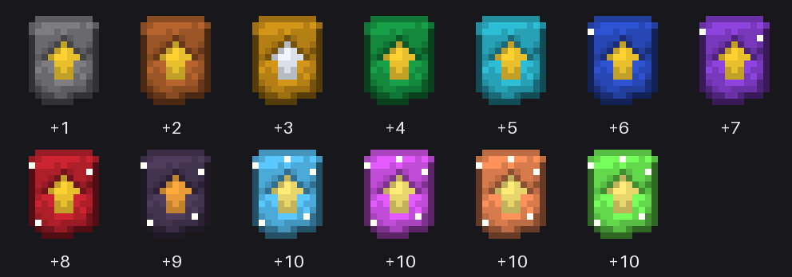

# Extended Vanilla Endgame (EVE)

  

A Fabric mod for Minecraft **26.1.2** that keeps the game exactly vanilla until the endgame, then lets you upgrade netherite tools and armor to **+1 through +10** — with costs that roughly double every level.

## How it works

### 1. Upgrade Cores (one per level, consumed on use)

The +1 core is crafted directly:

```
[Diamond Block]  [Crying Obsidian] [Iron Block]
[Crying Obsidian] [Netherite Ingot] [Crying Obsidian]
[Gold Block]     [Crying Obsidian] [Emerald Block]
```

Every higher core is simply **two cores of the previous tier combined** (shapeless, no extra item), so the raw material cost doubles each level — a +10 core is worth 512 +1 cores.


### 2. Upgrade in the smithing table

Smithing table: `Upgrade Core +N` + `your +(N-1) item` + `catalyst`:

| Level | Catalyst |
|-------|----------|
| +1 | Diamond Block |
| +2 | Netherite Ingot |
| +3 | Netherite Block |
| +4 | Nether Star |
| +5 | Heavy Core |
| +6 | Netherite Block |
| +7 | Nether Star |
| +8 | Heavy Core |
| +9 | Nether Star |
| +10 | Heavy Core |


Each level grants (cumulative): **+1 attack damage**, **+1 armor**, **+0.5 armor toughness**, **+20% mining speed**, **+25% durability**. Enchantments and damage are preserved.



Upgradable: netherite sword/pickaxe/axe/shovel/hoe/helmet/leggings/boots and the Winged Netherite Chestplate (tag `eve:upgradable` — datapacks can extend it).

### 3. The chestplate gate

A plain netherite chestplate **cannot** be upgraded. First craft a **Wing Smithing Template**:

```
[Phantom Membrane] [Netherite Ingot] [Phantom Membrane]
[Netherite Ingot]  [Nether Star]     [Netherite Ingot]
[Phantom Membrane] [Netherite Ingot] [Phantom Membrane]
```


Then in the smithing table: `Wing Template` + `Netherite Chestplate` + `Elytra` → **Winged Netherite Chestplate** — full netherite protection *and* elytra flight (vanilla glider component), and it's the only chestplate that accepts +N upgrades.


## Building

```
./gradlew build
```

Output: `build/libs/extended-vanilla-endgame-<version>.jar`. Requires Java 25, Fabric Loader ≥ 0.19.3 and Fabric API. Gradle runs on Java 25 (path pinned in `gradle.properties` via `org.gradle.java.home`; adjust for your machine). Uses Mojang official mappings (Yarn was discontinued after 1.21.11).

## TODO

- Custom textures for the wing template and winged chestplate (upgrade cores now have per-tier recolored textures; the other two still reuse vanilla art)
- Elytra wings back-rendering for the winged chestplate (flight works, wings just don't show)
