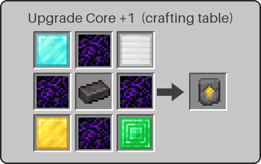
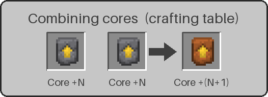
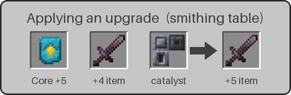
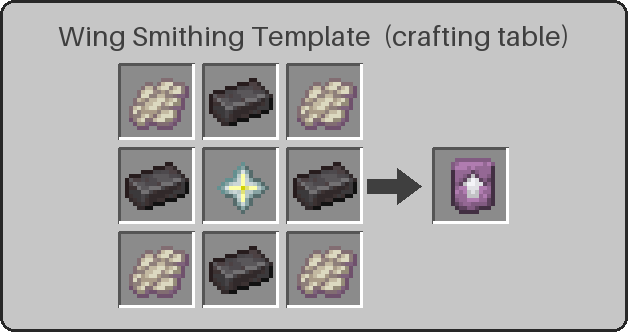
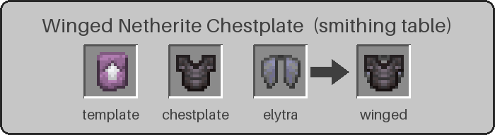
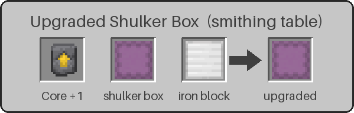

# Extended Vanilla Endgame (EVE)

  

A Fabric mod for Minecraft **26.1.x and 26.2** that keeps the game exactly vanilla until the endgame, then lets you upgrade netherite tools and armor to **+1 through +10** — with costs that roughly double every level.

## How it works

### 1. Upgrade Cores (one per level, consumed on use)

The +1 core is crafted directly:

```
[Diamond Block]  [Crying Obsidian] [Iron Block]
[Crying Obsidian] [Netherite Ingot] [Crying Obsidian]
[Gold Block]     [Crying Obsidian] [Emerald Block]
```

Every higher core is simply **two cores of the previous tier combined** (shapeless, no extra item), so the raw material cost doubles each level — a +10 core is worth 512 +1 cores.




### 2. Upgrade in the smithing table

Smithing table: `Upgrade Core +N` + `your +(N-1) item` + `catalyst`:

| Level | Catalyst | Level | Catalyst |
|-------|----------|-------|----------|
| +1 | Iron Block | +6 | Netherite Ingot |
| +2 | Emerald Block | +7 | Netherite Block |
| +3 | Gold Block | +8 | Enchanted Golden Apple |
| +4 | Diamond | +9 | Nether Star |
| +5 | Diamond Block | +10 | Heavy Core |



Each level grants (cumulative): **+1 attack damage**, **+1 armor**, **+0.5 armor toughness**, **+20% mining speed**, **+25% durability**. Enchantments and damage are preserved.


Upgradable: netherite sword/spear/pickaxe/axe/shovel/hoe/helmet/leggings/boots, the Winged Netherite Chestplate, a Sponge, and any Shulker Box (tag `eve:upgradable` — datapacks can extend it).

### 3. The chestplate gate

A plain netherite chestplate **cannot** be upgraded. First craft a **Wing Smithing Template**:

```
[Phantom Membrane] [Netherite Ingot] [Phantom Membrane]
[Netherite Ingot]  [Nether Star]     [Netherite Ingot]
[Phantom Membrane] [Netherite Ingot] [Phantom Membrane]
```



Then in the smithing table: `Wing Template` + `Netherite Chestplate` + `Elytra` → **Winged Netherite Chestplate** — full netherite protection *and* elytra flight (vanilla glider component), and it's the only chestplate that accepts +N upgrades.



### 4. The Absorbing Sponge

Upgrade a plain **Sponge** in the smithing table (Core +1 + sponge + iron block) and it becomes an **Absorbing Sponge** — a sponge that drinks **lava** as well as water. It can be upgraded up to **+7**.

It behaves like a vanilla sponge with two twists:

- **Reusable.** It sits dry until liquid first touches it, absorbs once, and turns wet (texture change). Breaking it always drops the **dry** sponge back — with its tier intact — so you can place it again and again. (To absorb a second time, just break and re-place it.)
- **Lava + water radii grow on alternating levels.** Lava always reaches a smaller radius than water:

| Tier | Water radius | Lava radius | Tier | Water radius | Lava radius |
|------|--------------|-------------|------|--------------|-------------|
| +1 | 6 | 3 | +5 | 10 | 7 |
| +2 | 8 | 3 | +6 | 12 | 7 |
| +3 | 8 | 5 | +7 | 12 | 9 |
| +4 | 10 | 5 | | | |

The Absorbing Sponge item is fireproof, so it survives a swim in the lava it's meant to drink. It caps at +7 even though Upgrade Cores go to +10.

### 5. The Upgraded Shulker Box

Upgrade any **Shulker Box** in the smithing table (Core +1 + shulker box + iron block) and it becomes an **Upgraded Shulker Box**. The upgrade keeps the box's **colour and contents**.



It is a real shulker box — same animated lid, texture, and "contents stay in the item when you break it" — with one difference:

- **It can hold normal shulker boxes** (and any other item). In vanilla you can't put a shulker box inside a shulker box; an upgraded box lets you. It will **not** accept another upgraded box, so there's no infinite nesting.

It comes in all 16 colours plus the default, and it's **dyeable** exactly like a vanilla shulker box: combine it with a dye in a crafting grid to recolour it (contents preserved), and re-dye it any time.

## Building

```
./gradlew build
```

Output: `build/libs/extended-vanilla-endgame-<version>.jar`. Requires Java 25, Fabric Loader ≥ 0.19.3 and Fabric API. Gradle runs on Java 25 (path pinned in `gradle.properties` via `org.gradle.java.home`; adjust for your machine). Uses Mojang official mappings (Yarn was discontinued after 1.21.11).

## TODO

- Elytra wings back-rendering for the winged chestplate (flight works, wings just don't show)
